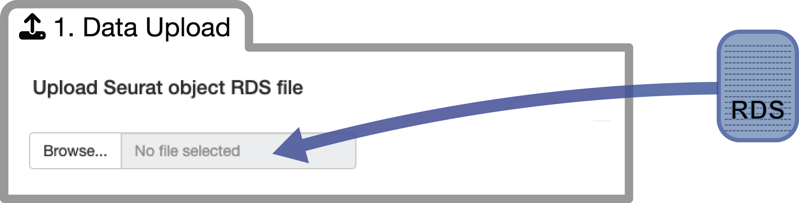
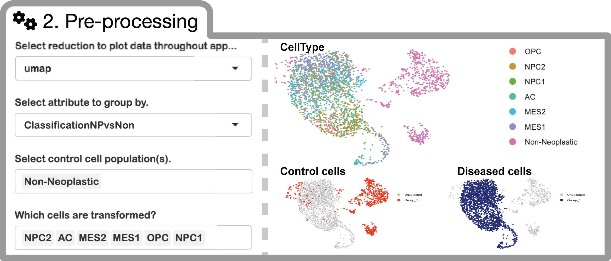
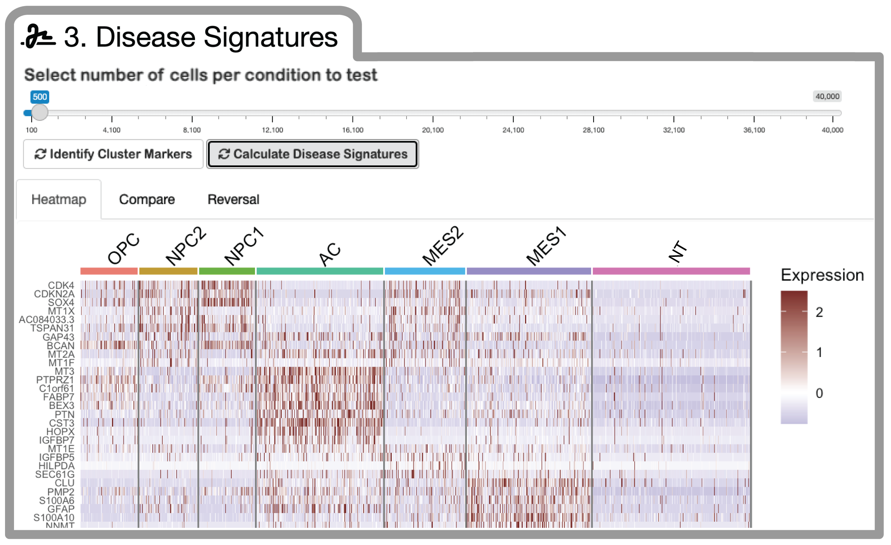

<!-- Improved compatibility of back to top link: See: https://github.com/othneildrew/Best-README-Template/pull/73 -->
<a name="readme-top"></a>
<!--
*** Thanks for checking out the Best-README-Template. If you have a suggestion
*** that would make this better, please fork the repo and create a pull request
*** or simply open an issue with the tag "enhancement".
*** Don't forget to give the project a star!
*** Thanks again! Now go create something AMAZING! :D
-->


<!-- PROJECT SHIELDS -->
<!--
*** I'm using markdown "reference style" links for readability.
*** Reference links are enclosed in brackets [ ] instead of parentheses ( ).
*** See the bottom of this document for the declaration of the reference variables
*** for contributors-url, forks-url, etc. This is an optional, concise syntax you may use.
*** https://www.markdownguide.org/basic-syntax/#reference-style-links
-->
[![Contributors][contributors-shield]][contributors-url]
[![Forks][forks-shield]][forks-url]
[![Stargazers][stars-shield]][stars-url]
[![Issues][issues-shield]][issues-url]
[![MIT License][license-shield]][license-url]
[![LinkedIn][linkedin-shield]][linkedin-url]


<!-- PROJECT LOGO -->
<br />
<div align="center">
  <a href="https://github.com/AyadLab/ISOSCELES">
    
  </a>
</div>

<br /> 

<div align="center">
  <p align="center">
    <strong>(I)nferred Drug (S)ensitivity (O)perating on the integration of (S)ingle-(C)ell (E)xpression and (L)1000 (E)xpression (S)ignatures</strong>
    <br />
    <br />
    <a href="https://github.com/AyadLab/ISOSCELES"><strong>Explore the docs »</strong></a>
    <br />
    <br />
    <a href="https://github.com/AyadLab/ISOSCELES/issues">Report Bug</a>
    ·
    <a href="https://github.com/AyadLab/ISOSCELES/issues">Request Feature</a>
  </p>
</div>


<!-- TABLE OF CONTENTS -->
<details>
  <summary>Table of Contents</summary>
  <ol>
    <li>
      <a href="#about-the-project">About ISOSCELES</a>
      <ul>
        <li><a href="#built-with">Built With</a></li>
      </ul>
    </li>
    <li>
      <a href="#getting-started">Getting Started</a>
      <ul>
        <li><a href="#prerequisites">Prerequisites</a></li>
        <li><a href="#installation">Installation</a></li>
      </ul>
    </li>
    <li><a href="#usage">Usage</a></li>
    <li><a href="#roadmap">Roadmap</a></li>
    <li><a href="#contributing">Contributing</a></li>
    <li><a href="#license">License</a></li>
    <li><a href="#contact">Contact</a></li>
    <li><a href="#acknowledgments">Acknowledgments</a></li>
  </ol>
</details>


<!-- ABOUT THE PROJECT -->
## About ISOSCELES

ISOSCELES operates through the integration of drug-response transcriptional consensus signatures (TCSs) derived from the LINCS L1000 dataset with multi-subject single-cell RNA sequencing data, and facilitates analysis of drug and cell connectivity as a function of expression discordance from multiple perspectives.

<div align="center">
  <a href="https://github.com/AyadLab/ISOSCELES">
    
  </a>
</div>

<!-- <p align="right">(<a href="#readme-top">back to top</a>)</p> --> 

<br /> 

<!-- BUILT WITH! --> 
<div align="center">
  Built using 
  <a href="https://r-project.org">
    
  </a>
   and 
  <a href="https://shiny.posit.co">
    
  </a>
</div>

<!-- GETTING STARTED -->
<!-- ## Getting Started --> 

###### ISOSCELES is available via shinyapps.io, or as a standalone R package. 

<p align="left">
  <a href="https://robert-k-suter.shinyapps.io/isosceles/"><strong>You can find ISOSCELES on shinyapps.io here! »</strong></a>
</p>

###### Due to the inherent large size of scRNAseq datasets, we highly recommend installing the ISOSCELES R package to run the application locally. 

<p align="right">(<a href="#readme-top">back to top</a>)</p>

## The ISOSCELES R Package

### Prerequisites

The ISOSCELES R package  for R > 4.3.0 can be installed with devtools...

Installation of devtools in R:

```{r}
# Install devtools from CRAN
install.packages("devtools")

# Or the development version from GitHub:
# install.packages("devtools")
devtools::install_github("r-lib/devtools")
```

ISOSCELES requires the following additional R packages:

```{r}
library(shiny)
library(Seurat)
library(ggplot2)
library(tibble)
library(cowplot)
library(viridis)
library(dplyr)
library(ggsci)
library(ggrepel)
library(tidyverse)
library(plotly)
library(htmlwidgets)
library(reshape2)
library(Hmisc)
library(corrplot)
library(pheatmap)
library(grid)
library(MAST)
library(shinydashboard)
library(shinythemes)
library(scales)
library(ggforce)
library(EnhancedVolcano)
library(DT)
```
Some of these dependencies will need to be installed via Bioconductor...

Installation of BiocManager:

```{r}
if (!require("BiocManager", quietly = TRUE))
    install.packages("BiocManager")
BiocManager::install(version = "3.17")
```
and to install core bioconductor packages:
```{r}
BiocManager::install()
```

-----
### Installation from Source

##### Using devtools, the ISOSCELES R package can be installed from the source file. 

<p align="left">
  <a href="https://drive.google.com/u/0/uc?id=1geEhIXKRkSBII37V4TMo5bl2AzcUJ3zN&export=download"><strong>Download the ISOSCELES source file here! »</strong></a>
</p>

   ```{r}
   devtools::install_local("pathToYourSourceFile/ISOSCELES_0.0.0.9000.tar.gz")
   ```

<p align="right">(<a href="#readme-top">back to top</a>)</p>

<!-- #################################################################################################################################################### -->

<!-- USAGE EXAMPLES -->
-----
## Usage

Follow this brief tutorial to familiarize yourself with the application. 

### Launch the ISOSCELES application

Once installed, launching ISOSCELES is as easy as the following: 

```{r}
library(ISOSCELES) # load the ISOSCELES library including necessary drug signature data
ISOSCELES::runISOSCELES() # launch the ISOSCELES shiny GUI
```
-----
### Step 1. - Data Upload

ISOSCELES takes scRNAseq input in the form of a Seurat object saved as an RDS file. 

<div align="center">
  <a href="https://github.com/AyadLab/ISOSCELES">
    
  </a>
</div>

<br />
You can download a small example RDS file of a seurat object subsetted from our data presented within our manuscript here: 

Simply choose your file to upload and allow the app to load the Seurat object into the processing environment. Once it is fully loaded, you will see a prompt for the successful upload and to proceed to the pre-processing step. 

-----
### Step 2. - Pre-Processing

Analysis with ISOSCELES requires identification of tumor cell subpopulations, and non-tumor TME cell populations (control cell populations) using annotations within the metadata of your uploaded Seurat object. (i.e. obj@meta.data$cellType). Make sure that your annotations of interest are saved within your RDS file. 

<div align="center">
  <a href="https://github.com/AyadLab/ISOSCELES">
    
  </a>
</div>

<br />
Here, you may select the dimensionality reduction to use to visualize your data throughout the app (i.e. umap, pca, any custom reduction, etc.). 
<br />
You will also select the relevant metadata column to group your cells by. Once selected, you will be able to select the individual identities within those annotations identifying transformed tumor cells (for GBM, we chose to group by GBM cell transcriptional state (Neftel et al., 2019) and your control populations (non-tumor cell types). Your selections will be visualized by coloring selected cells by whether they are grouped as control cells or diseased cells.  

-----
### Step 3. - Single-Cell RNAseq Derived Disease Signatures

Based on your test (transformed / diseased) and control cell populations selected during pre-processing, you can now generate cell-state (or type) specific disease signatures. 
<br /> 
A slider allows you to sub-sample cells within each identity in order to speed up processing. 
<br />
Once completed, a heatmap will be generated to visualize the expression of top disease signature genes across all cells in your dataset. 
<br />
You can now navigate to the 'Compare' and 'Reversal' tabs to analyze and visualize disease signature correlations across tumor cell identities, and to score small molecules from the L1000 dataset for the reversal of these respective disease signatures. Disease signature and reversal score output can be downloaded as .csv files. 
<br />

<div align="center">
  <a href="https://github.com/AyadLab/ISOSCELES">
    
  </a>
</div>

-----
### Step 4. - In Silico Perturbation (Drug-Cell Connectivity Analysis


_For more examples, please refer to the [Documentation](https://example.com)_

<p align="right">(<a href="#readme-top">back to top</a>)</p>


<!-- ROADMAP -->
## Roadmap

- [ ] Feature 1
- [ ] Feature 2
- [ ] Feature 3
    - [ ] Nested Feature

See the [open issues](https://github.com/AyadLab/ISOSCELES/issues) for a full list of proposed features (and known issues).

<p align="right">(<a href="#readme-top">back to top</a>)</p>


<!-- CONTRIBUTING -->
## Contributing

Contributions are what make the open source community such an amazing place to learn, inspire, and create. Any contributions you make are **greatly appreciated**.

If you have a suggestion that would make this better, please fork the repo and create a pull request. You can also simply open an issue with the tag "enhancement".
Don't forget to give the project a star! Thanks again!

1. Fork the Project
2. Create your Feature Branch (`git checkout -b feature/AmazingFeature`)
3. Commit your Changes (`git commit -m 'Add some AmazingFeature'`)
4. Push to the Branch (`git push origin feature/AmazingFeature`)
5. Open a Pull Request

<p align="right">(<a href="#readme-top">back to top</a>)</p>


<!-- LICENSE -->
## License

Not currently distributed under any license. Public for manuscript review. 

<p align="right">(<a href="#readme-top">back to top</a>)</p>


<!-- CONTACT -->
## Contact

Robert K. Suter, PhD - [@biovibin](https://twitter.com/biovibin) - rks82@georgetown.edu
<br />
Nagi G. Ayad, PhD - [@nagi_ayad](https://twitter.com/nagi_ayad) - na853@georgetown.edu

Project Link: [https://github.com/AyadLab/ISOSCELES](https://github.com/AyadLab/ISOSCELES)

<div align="center">
  <a href="https://sites.google.com/georgetown.edu/ayadlab/">
    
  </a>
</div>

<p align="right">(<a href="#readme-top">back to top</a>)</p>


<!-- ACKNOWLEDGMENTS -->
## Acknowledgments

* []()
* []()
* []()

<p align="right">(<a href="#readme-top">back to top</a>)</p>


<!-- MARKDOWN LINKS & IMAGES -->
<!-- https://www.markdownguide.org/basic-syntax/#reference-style-links -->
[contributors-shield]: https://img.shields.io/github/contributors/AyadLab/ISOSCELES.svg?style=for-the-badge
[contributors-url]: https://github.com/AyadLab/ISOSCELES/graphs/contributors
[forks-shield]: https://img.shields.io/github/forks/AyadLab/ISOSCELES.svg?style=for-the-badge
[forks-url]: https://github.com/AyadLab/ISOSCELES/network/members
[stars-shield]: https://img.shields.io/github/stars/AyadLab/ISOSCELES.svg?style=for-the-badge
[stars-url]: https://github.com/AyadLab/ISOSCELES/stargazers
[issues-shield]: https://img.shields.io/github/issues/AyadLab/ISOSCELES.svg?style=for-the-badge
[issues-url]: https://github.com/AyadLab/ISOSCELES/issues
[license-shield]: https://img.shields.io/github/license/AyadLab/ISOSCELES.svg?style=for-the-badge
[license-url]: https://github.com/AyadLab/ISOSCELES/blob/master/LICENSE.txt
[linkedin-shield]: https://img.shields.io/badge/-LinkedIn-black.svg?style=for-the-badge&logo=linkedin&colorB=555
[linkedin-url]: https://linkedin.com/in/robert-suter-9a0a9667
[product-screenshot]: images/screenshot.png
[Next.js]: https://img.shields.io/badge/next.js-000000?style=for-the-badge&logo=nextdotjs&logoColor=white
[Next-url]: https://nextjs.org/
[React.js]: https://img.shields.io/badge/React-20232A?style=for-the-badge&logo=react&logoColor=61DAFB
[React-url]: https://reactjs.org/
[Vue.js]: https://img.shields.io/badge/Vue.js-35495E?style=for-the-badge&logo=vuedotjs&logoColor=4FC08D
[Vue-url]: https://vuejs.org/
[Angular.io]: https://img.shields.io/badge/Angular-DD0031?style=for-the-badge&logo=angular&logoColor=white
[Angular-url]: https://angular.io/
[Svelte.dev]: https://img.shields.io/badge/Svelte-4A4A55?style=for-the-badge&logo=svelte&logoColor=FF3E00
[Svelte-url]: https://svelte.dev/
[Laravel.com]: https://img.shields.io/badge/Laravel-FF2D20?style=for-the-badge&logo=laravel&logoColor=white
[Laravel-url]: https://laravel.com
[Bootstrap.com]: https://img.shields.io/badge/Bootstrap-563D7C?style=for-the-badge&logo=bootstrap&logoColor=white
[Bootstrap-url]: https://getbootstrap.com
[JQuery.com]: https://img.shields.io/badge/jQuery-0769AD?style=for-the-badge&logo=jquery&logoColor=white
[JQuery-url]: https://jquery.com 
[Shinyapps.io]: https://shiny.posit.co/images/shiny-solo.png
[Shiny-url]: https://shinyapps.io
[r-project.org]: https://www.r-project.org/Rlogo.png
[R-url]: https://r-project.org
